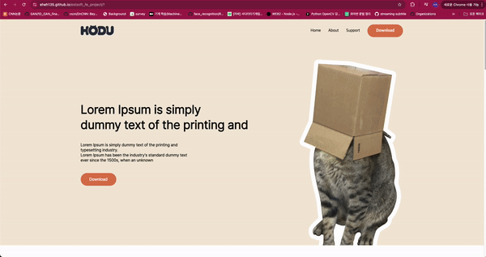

# ESTSoft_FE_Project (HODU)
오르미 6기 백엔드를 위한 프론트엔드 프로젝트

## 간략 설명
### 목표
Figma 디자인에 맞춰 최대한 같게 페이지를 만들고 배포하기.

### 실제 페이지 (배포)
https://eheh135.github.io/estsoft_fe_project/ 

### 파일 구조
html, js, css, asset(이미지, svg)를 나눴습니다.
```
.
├── README.md
├── asset
│   ├── img
│   │   ├── background_cat.png
│   │   ├── feature_cat.png
│   │   ├── gallery_cat1.png
│   │   ├── gallery_cat2.png
│   │   ├── gallery_cat3.png
│   │   ├── gallery_cat4.png
│   │   ├── gallery_cat5.png
│   │   ├── gallery_cat6.png
│   │   ├── intro_cat.png
│   │   ├── modal_background.png
│   │   └── modal_cat.png
│   └── svg
│       ├── Logo-fin.svg
│       ├── arrow-right.svg
│       ├── icon-blog.svg
│       ├── icon-facebook.svg
│       ├── icon-insta.svg
│       ├── icon-youtube.svg
│       ├── keyboard_arrow_up.svg
│       ├── mail.svg
│       └── menu.svg
├── css
│   ├── container.css
│   ├── font.css
│   ├── reset.css
│   ├── styles-responsive.css
│   └── styles.css
├── index.html
└── js
    ├── emailCheck.js
    ├── headerFixer.js
    ├── map.js
    ├── scroll.js
    └── toggleMenu.js
```

## 구현 내용
### preview
PC

Mobile


### 요구사항 명세
1. 피그마를 참고하여 페이지 구현을 합니다.
2. 모바일 화면도 고려하여 페이지 구현을 합니다.
3. 스크롤시 헤더가 고정되게 합니다. (단, 처음에는 고정된 상태가 아닙니다.)
4. 스크롤 탑 버튼을 구현합니다. 
    1. 스크롤 탑 버튼은 스크롤시 나타납니다.
    2. 스크롤 탑 버튼은 푸터 아래로 내려가지 않습니다.
    3. 스크롤 탑 버튼을 누르면 스크롤이 최상단으로 올라갑니다. (단, 부드럽게 올라가야 합니다.)
5. 구독하기 모달창
    1. 이메일을 입력하고 `Subscribe` 버튼을 클릭하면 모달창이 나타납니다.
    2. 이메일 유효성 검사를 진행해야 합니다. (값이 들어가지 않거나 이메일 형식이 유효하지 않으면 alert 창으로 경고 문구가 떠야합니다.)
    3. 이메일이 잘 입력되었다면 모달창이 뜹니다. 이때 모달창의 `OK! I love HODU` 버튼을 클릭하면 form이 제출되고 모달창이 닫힙니다.

### 요구사항 명세 구현
#### 스크롤시 헤더가 고정되게 합니다. (단, 처음에는 고정된 상태가 아닙니다.)
CSS와 Javascript로 구현 하였습니다.
```css
/* 기본 헤더 스타일 */
header {
    width: 100%;
    background-color: var(--secondary-color);
    padding: 20px 0;
    transition: all 0.3s ease;
    z-index: 1000;
}

/* 스크롤 시 고정 상태로 변경되는 스타일 */
header.fixed {
    position: fixed;
    top: 0;
    left: 0;
    width: 100%;
}
```
```javascript
window.onload = function() {
    var header = document.getElementById("header");

    var sticky = header.offsetTop;

    window.onscroll = function() { fixHeader() };

    function fixHeader() {
        if (window.pageYOffset > sticky) {
            header.classList.add("fixed");
        } else {
            header.classList.remove("fixed");
        }
    }
};
```
#### 스크롤 탑 버튼을 구현합니다. 
조건에 맞게 Javascript로 구현하였습니다.
```javascript
window.addEventListener("scroll", function() {
    const scrollBtn = document.getElementById("scroll-top");

    if (window.scrollY > 300) {
        scrollBtn.classList.add("visible");
    } else {
        scrollBtn.classList.remove("visible");
    }
});

document.getElementById("scroll-top").addEventListener("click", function() {
    window.scrollTo({
        top: 0,
        behavior: "smooth"
    });
});
```
#### 구독하기 모달창
정규식을 사용하여서 Javascript로 구현하였습니다.
```javascript
function checkEmail(str) {
    let reg_email = /^([0-9a-zA-Z_\.-]+)@([0-9a-zA-Z_-]+)\.([a-zA-Z]{2,6})(\.[a-zA-Z]{2,6})?$/;
    return reg_email.test(str);
}

function goToModal() {
    let email = document.getElementById("email-input");

    if (!email.value) {
        alert("이메일을 입력해 주세요!");
        email.focus();
        return;
    }
    else if (!checkEmail(email.value)) {
        alert(email.value + " : 이메일 형식이 잘못되었습니다.\n다시 확인해 주세요.");
        email.focus();
        return;
    }
    else {
        document.getElementById("subscribe-modal").style.display = "flex";
    }
}
```